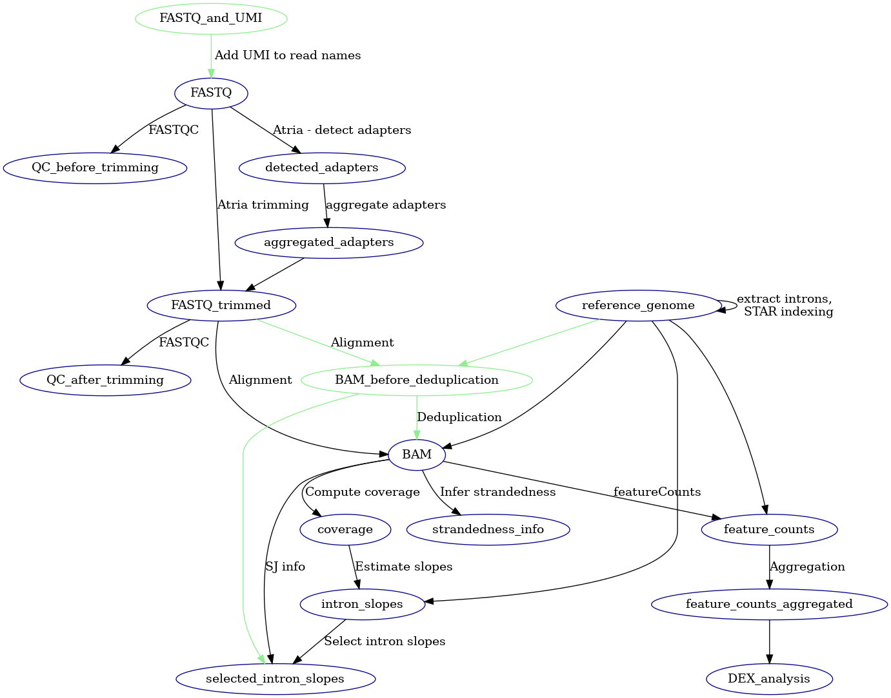

# pol-II-analysis

This repository contains a pipeline for processing total or nascent RNA-seq data,
focusing on an analysis related to the RNA Polymerase II (pol-II).

Currently, it focuses on the calculation of pol-II speed, based on the paper
[Debès, Cédric, et al. "Ageing-associated changes in transcriptional elongation influence longevity](https://www.nature.com/articles/s41586-023-05922-y).
In the future, we plan to extend this repository to analyze other phenomena related to pol-II.

## Overview
This repository implements a pipeline for processing  total or nascent RNA-seq data. 
The pipeline consist of multiple steps, and can be visualized as the following computational graph:

Each node in the graph represent a folder with a data, and edges represent the dependencies - all parent nodes are required to create
the given child node.

The starting point is assumed to be the ```FASTQ``` folder, containing the un-processed reads. 
In a case that your data are already processed, you may run only the corresponding part of pipeline 
(e.g. if your FASTQ data are already trimmed, you may skip the trimming steps 
implemented in this repository and start from the ```FASTQ_trimmed``` folder.)

All the processing steps are run through Docker. We provide [Dockerfiles](./dockerfiles) used to build the Docker images.

Currently, the code is run by executing shell scripts in the [pipeline](./pipeline) folder, 
where each script compute one step (node in the computational graph). The scripts have
an option to either run the computation locally, or submit it via
```sbatch``` command as a jobs to a queue of Slurm Workload Manager.

## Setup
The folder [misc](./misc) provide several utility scripts used for initial setup. 
These steps are not specific for a given dataset.
1. **Building the docker images**: As a first step, execute the script 
[build_images.sh](misc/build_images.sh), which will build docker images
used in the pipeline. The images will be also saved as a ```.tar``` files to a disk.
2. **Genome indexing**: We are using [STAR](https://github.com/alexdobin/STAR) 
for read alignment in the pipeline. Before running the alignment step,
it's necessary to prepare STAR index. 
To do that, run the script [prepare_star_index.sh](misc/prepare_star_index.sh). 
The script require the annotation ```.gtf``` file and the genome sequence ```FASTA``` file to be placed
in given folder, passed as an argument to the script. The script will generate a subfolder 
named ```STAR_index``` in the genome folder.
3. **Extracting introns from the .gtf file**: Run the script [extract_genomic_features.sh](misc/extract_genomic_features.sh),
which will extract the introns from the ```.gtf``` file and save them separately (as a ```.bed``` file)
to the genome folder. As ```.gtf``` from different sources ([Ensembl](https://www.ensembl.org/index.html) 
resp. [Gencode](https://www.gencodegenes.org/)) differ in their naming of UTR
features (Ensembl distinguish ```3_prime_utr``` and ```5_prime_utr```, while Gencode names both as ```UTR```),
the type of ```.gtf``` file must be provided as an argument to the script (```ensembl``` or ```gencode``` ).
## Workflow
This section provides information how to process a given dataset, after the steps from the 
*Setup* sections have been completed.
### Data preparation
We will start from a ```FASTQ``` folder, containing unprocessed paired reads.
The name of the folder can be arbitrary (it is not hardcoded in the pipeline), although we
recommend sticking to the names provided in the computational graph visualization above.

The ```FASTQ``` folder is supposed to contain one subfolder for each sample. Names of
the subfolders will be used as sample names in every following steps of the pipeline. Therefore,
the naming can be again arbitrary.

Each sample subfolder is expected to contain files ```R1.fastq.gz``` and ```R2.fastq.gz``` with
reads 1 and 2, respectively. The naming of these files **is** hardcoded in the pipeline 
(as well as the naming of all files that will be created during the pipeline run). The FASTQ input files
are expected to be compressed by gunzip (hence the ```.gz``` extension).
If the sequencing was done with Unique Molecular Identifiers (UMIs), we expect that the
UMIs are added to the read names (using e.g. the ```extract``` command of [UMI-tools](https://umi-tools.readthedocs.io/en/latest/)).

### Running the pipeline
Every script in the pipeline folder has an argument ```-o``` which define path to the output folder, and
also ```-i``` argument for the input folder (with an exception to the steps that require multiple input folders, in which
cases the required input folders are passed by multiple arguments).
We will assume that these folders have the same names as in the pipeline visualization above.
1. **Initial quality control**: Running the script [batch_qc.sh](pipeline/batch_qc.sh) on the ```FASTQ```
input folder will generate [FastQC](https://www.bioinformatics.babraham.ac.uk/projects/fastqc/) reports,
which can be used e.g. to evaluate presence of adapters in the reads.
2. **Detecting adapters**: Script [batch_detect_adapers.sh](pipeline/batch_detect_adapers.sh) will use [Atria](https://github.com/cihga39871/Atria)
to detect the adapter sequence in reads in ```FASTQ``` folder and store the 
detected adapters in the ```detected_adapters``` folder.
3. **Aggregating adapters**: The adapters are expected to be the same in all samples. Script [run_aggregate_adapters.sh](pipeline/run_aggregate_adapters.sh)
will aggregate the adapters from all samples and make sure that they are all the same. 
The results will be stored in a JSON file ```aggregated_adapters.json``` in the ```aggregated_adapters```
folder. If the adapters differ across samples, the flag ```adapters_successfully_detected``` in the JSON would be set to False.
4. **Trimming**: Running [batch_trimming.sh](pipeline/batch_trimming.sh) will use the detected adapters to trimm the reads
and store them in the folder ```FASTQ_trimmed```.
5. **Quality control after trimming**: After the trimming step, we will again use FastQC to generate reports and assess
whether the trimming was successful. This is done by again running the script [batch_qc.s](pipeline/batch_qc.sh),
this time with ```FASTQ_trimmed``` folder as an input.
6. **Alignment**: We will use [STAR](https://github.com/alexdobin/STAR) for alignment. Besides producing
the ```.bam``` files, it will also generate count matrices (which will be used to infer the strandedness of the data later on) and file
with detected splice junctions. Running the start is done by the script [batch_align.sh](pipeline/batch_align.sh),
creating the ```BAM``` folder.
7. **Inferring strandedness**: Data can be stranded by either type 1 or 2, which determines which read (1 resp. 2)
is on the same strand as the read pair as a whole (the reads 1 and 2 are always mapped to a different strand). We will use
gene count matrices produces by STAR to determine strandedness type of our data, by comparing the amount
of unmapped reads in both cases. This is achieved by running the script [run_infer_strandedness.sh](pipeline/run_infer_strandedness.sh),
which will generate JSON file ```strandedness_info.json``` in the folder ```strandedness_info```.
8. **Feature count**: Besides count matrices produced by STAR, we will also generate
count matrices by [featureCounts](https://subread.sourceforge.net/featureCounts.html) tool. One of the advantage is that it allows to assign
gene to a read not only by its overlap with exons (as it's done by STAR), but by overlap with the whole gene,
which is more appropriate for total or nascent RNA-seq. Feature count is run by the script
[batch_feature_counts.sh](pipeline/batch_feature_counts.sh).
9. **Aggregating feature counts**: Previous steps produces one file with counts for each sample.
For subsequent analysis, it may be more convenient to have the counts aggregated in a single matrix. This
can be achieved by running the script... --*TODO: add missing script for aggregation*--
10. **Computing coverage**: Although the STAR also produced coverage files, we will use custom script for coverage computation. 
One issue with STAR coverage files is that the coverage is computed over reads and not read pairs, i.e. the overlapping
part of read pair is counted twice. We will also compute intronic coverage in a custom way: we will assume
that the rightmost position of a read pair, if located within an intron, correspond to a pol-II producing a transcript.
We will therefore assume that the transcript span the whole range from intron start up to this point, and compute coverage
over such transcripts. The coverage computation is done by running [batch_compute_coverage.sh](pipeline/batch_compute_coverage.sh),
storing the results in ```coverage``` folder.
11. **Slope estimation**: The coverage is used to estimate intronic slopes of transcript coverage by running
[batch_slope_estimation.sh](pipeline/batch_slope_estimation.sh), storing the results in the
```intron_slopes``` folder.
